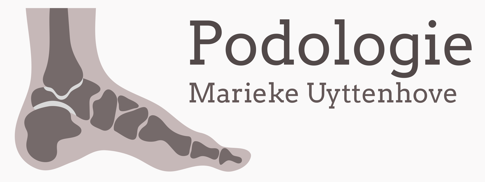

Marieke legt zich toe op voetzorg zoals eelt- of nagelproblemen, en ook op biomechanisch onderzoek waarbij ze een oplossing zoekt voor voet-, knie-, heup- en rugproblemen. 

Marieke leidt de praktijk Podologie Lieveke Luyckx in Schoten en behandelt daarnaast patiënten aan huis in regio Kruibeke.